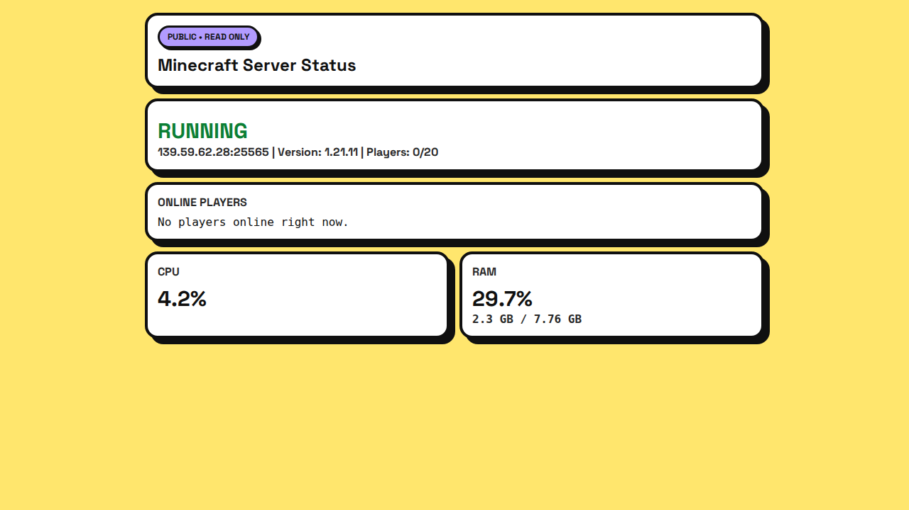

# MC Dashboard

```text
███╗   ███╗ ██████╗   ██████╗  █████╗ ███████╗██╗  ██╗██████╗  ██████╗  █████╗ ██████╗ ██████╗
████╗ ████║██╔════╝   ██╔══██╗██╔══██╗██╔════╝██║  ██║██╔══██╗██╔═══██╗██╔══██╗██╔══██╗██╔══██╗
██╔████╔██║██║        ██║  ██║███████║███████╗███████║██████╔╝██║   ██║███████║██████╔╝██║  ██║
██║╚██╔╝██║██║        ██║  ██║██╔══██║╚════██║██╔══██║██╔══██╗██║   ██║██╔══██║██╔══██╗██║  ██║
██║ ╚═╝ ██║╚██████╗██╗██████╔╝██║  ██║███████║██║  ██║██████╔╝╚██████╔╝██║  ██║██║  ██║██████╔╝
╚═╝     ╚═╝ ╚═════╝╚═╝╚═════╝ ╚═╝  ╚═╝╚══════╝╚═╝  ╚═╝╚═════╝  ╚═════╝ ╚═╝  ╚═╝╚═╝  ╚═╝╚═════╝
```

A FastAPI-based Minecraft server dashboard with:
- Secure login + lockout protection
- Start/stop/restart + automation toggles
- Live console + safety tiers
- Players/ops/whitelist tools
- World backups and restore
- Public read-only status page
- Wilson OP assistant (chat-driven in-game helper)

## Screenshot



## Features

- Real-time dashboard updates via WebSocket
- Read-only public status page for sharing server health
- Wilson OP assistant that listens to OP chat messages containing `wilson`
- In-game player onboarding greeting + Telegram join notifications
- Plugin/mod staging panel
- Scheduler for periodic restart/backup

## Tech stack

- Python 3.11+
- FastAPI + Uvicorn
- psutil, mcstatus, python-dotenv
- systemd (recommended for production)

## Quick start

1) Clone

```bash
git clone https://github.com/Adichapati/mc-dashboard.git
cd mc-dashboard
```

2) Create virtualenv + install deps

```bash
python3 -m venv .venv
. .venv/bin/activate
pip install --upgrade pip
pip install fastapi uvicorn psutil mcstatus python-dotenv starlette
```

3) Configure environment

Create `.env` in repo root:

```env
# Core
BIND_HOST=0.0.0.0
BIND_PORT=18789
MINECRAFT_DIR=/root/minecraft-1.21.11
MC_HOST=127.0.0.1
MC_PORT=25565
MC_TMUX_SESSION=mcserver

# Auth (hashes, not plaintext)
AUTH_USERNAME=sprake
AUTH_PASSWORD_HASH=<password-hash>
AUTH_GUEST_USERNAME=guest
AUTH_GUEST_PASSWORD_HASH=<guest-password-hash>
SESSION_SECRET=<long-random-secret>
PUBLIC_READ_TOKEN=<public-readonly-token>

# Optional Telegram join notifications
TELEGRAM_BOT_TOKEN=
TELEGRAM_CHAT_ID=

# Wilson AI
WILSON_AI_ENABLED=true
WILSON_AI_PROVIDER=copilot
WILSON_AI_BASE_URL=https://api.githubcopilot.com/chat/completions
WILSON_AI_MODEL=gpt-4o-mini
WILSON_AI_TOKEN=<token>
WILSON_OP_COOLDOWN_SEC=2.5
WILSON_MAX_REPLY_CHARS=220
```

4) Run locally

```bash
. .venv/bin/activate
uvicorn main:app --host 0.0.0.0 --port 18789
```

Open:
- Private dashboard: `http://<server-ip>:18789/`
- Public read-only page: `http://<server-ip>:18789/public/<PUBLIC_READ_TOKEN>`

## One-click systemd service setup

Create `/etc/systemd/system/openclaw-dashboard.service`:

```ini
[Unit]
Description=OpenClaw-style Minecraft Dashboard (auth)
After=network.target

[Service]
Type=simple
WorkingDirectory=/root/openclaw-dashboard
EnvironmentFile=/root/openclaw-dashboard/.env
ExecStart=/root/openclaw-dashboard/.venv/bin/uvicorn main:app --host 0.0.0.0 --port 18789
Restart=always
RestartSec=3

[Install]
WantedBy=multi-user.target
```

Enable + start:

```bash
sudo systemctl daemon-reload
sudo systemctl enable --now openclaw-dashboard.service
sudo systemctl status openclaw-dashboard.service --no-pager
```

## Notes on Wilson OP assistant

- Trigger by mentioning `wilson` in OP chat.
- Wilson can answer Minecraft questions and run safe console commands.
- Safety filters block destructive/high-risk server commands.
- Placeholder protection prevents fake success messages from invalid command targets.

## Security checklist

- Never commit `.env`
- Use password hashes, not plaintext passwords
- Rotate `SESSION_SECRET` and tokens periodically
- Keep public page token unguessable

## License

MIT (or your preferred license)
